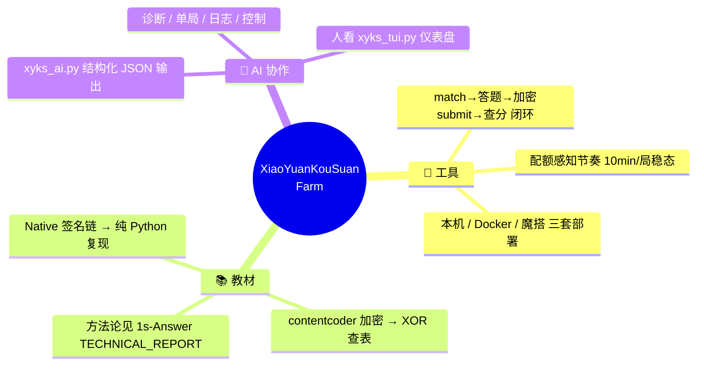
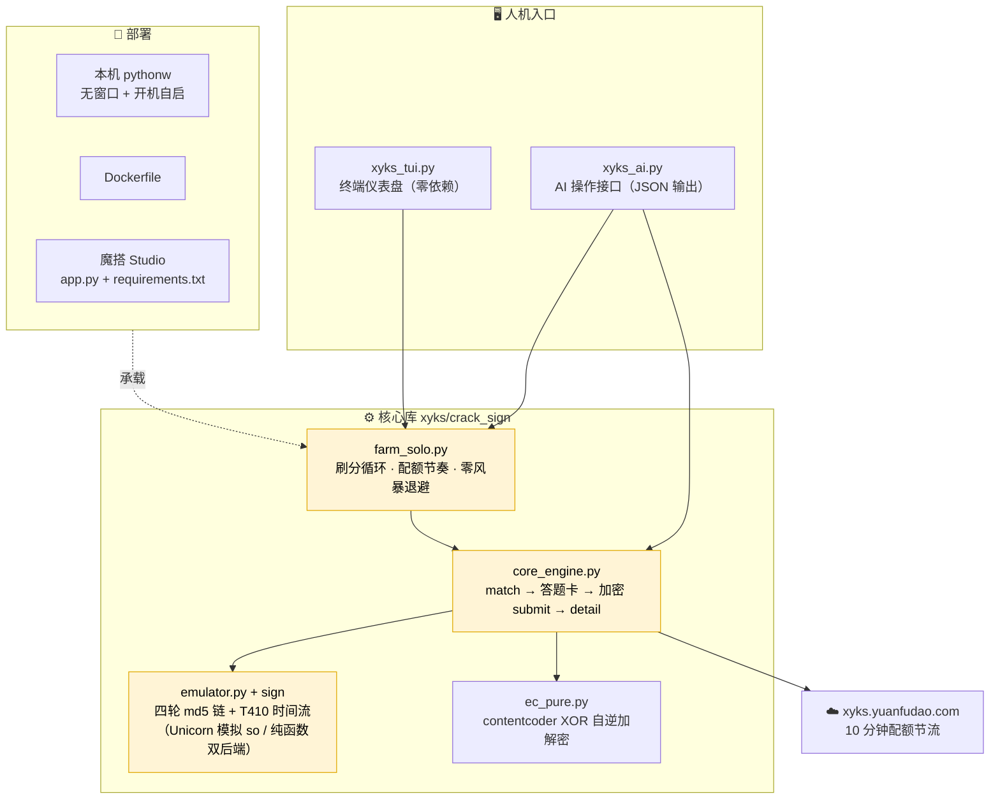
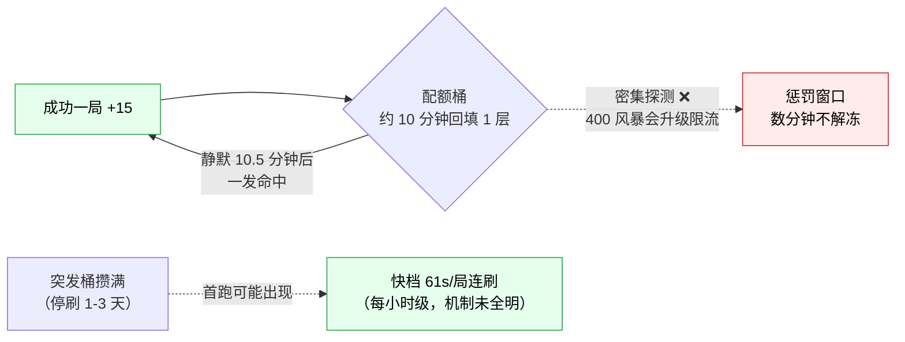
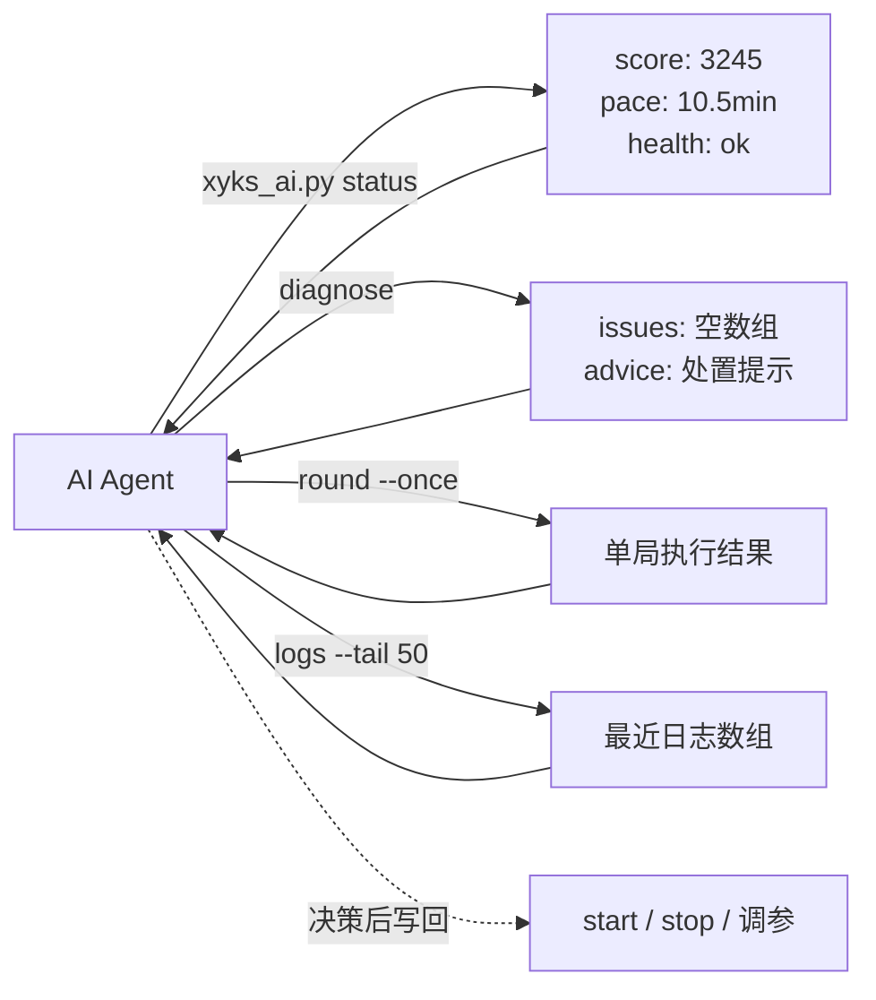

# XiaoYuanKouSuan-Farm

> **🎁 想释放双手？** 把下面「🚀 一句话部署」章节中的**指令块**整段复制给你的 AI Agent：它会自己拉取本仓库、引导你在魔搭社区拿 Token、引导你收短信验证码、上传云端并验证到常开刷分为止——你只需要复制粘贴几段内容，全程不用看懂任何技术章节。人类读者可直接跳到「项目定位」；部署全流程以本仓库教程为准，Agent 照做即可。

> 小猿口算 PK 荣誉分自动刷分工具：请求签名 / 内容加密的纯 Python 还原 + 配额感知的刷分循环 + 人（TUI）/ AI（JSON CLI）双驱动接口。
>
> 🔐 逆向原理与改包 APK 见姊妹仓库 **[XiaoYuanKouSuan-1s-Answer](https://github.com/GaoYangHeng/XiaoYuanKouSuan-1s-Answer)**（技术报告、so patch、smali 工程都在那边，本仓库不重复收录，只引用）。

## 🚀 一句话部署（人类可略过 · Agent 必读）

### ① 复制给 Agent 的指令

```text
拉取 https://github.com/GaoYangHeng/XiaoYuanKouSuan-Farm 并通读其 README 的「Agent 部署手册」章节，
严格按手册逐步执行，直至魔搭云端常开刷分验证通过。执行准则：
1. 每步先用一句话说明将做什么，再执行；凡需用户输入（Token / 手机号 / 验证码），先输出明确的
   引导话术并停下等待，收到后只经环境变量传入命令，禁止写入任何文件或代码仓库。
2. 一切运维操作走 `python xyks_ai.py <cmd>`（stdout 为单个 JSON，退出码 0/1/2）；
   diagnose 退出码 2 时，按返回的 issues[].fix 逐条处置后复跑。
3. 部署目标 = 魔搭 Studio（免费 2vCPU、国内直连）；仓库必须保持 Private；
   不得提交 *.so / login136.json / *.jsonl / *.log。
4. 完成后向用户汇报：状态页地址、当前周荣誉分、预期节奏（约 10 分钟/局，服务端配额所致）。
```

### ② Agent 部署手册

> 本手册即教程本体，按顺序执行；所有命令均在仓库根目录运行。
> Windows 用 PowerShell 语法示例，Linux 将 `$env:X="..."` 换成 `X=... ` 前缀即可。

#### 步骤 0 · 环境自检

```text
□ python ≥ 3.10（python -V）   □ git 可用   □ 网络可访问 github.com / modelscope.cn
□ pip install -r requirements.txt        # unicorn + pyelftools + pycryptodome
```

#### 步骤 1 · 拉取与整理

```bash
git clone https://github.com/GaoYangHeng/XiaoYuanKouSuan-Farm.git xyks-farm
cd xyks-farm
```

| 目录/文件 | 用途 |
|---|---|
| `xyks/crack_sign/` | 核心引擎（签名模拟 / 加解密 / 刷分循环 / 登录） |
| `xyks_ai.py` | **Agent 唯一操作接口**（status/score/round/logs/diagnose/start/stop） |
| `xyks_tui.py` | 给人看的终端仪表盘（可向用户介绍，Agent 不用） |
| `scripts/ms_push.py` | 上传并部署到魔搭 |
| `docs/` | 架构 / 配额 / 部署三篇（用户想深入了解时再给链接） |

签名 so **已随仓库附带**（`xyks/so/`，取自官方 APK 的公开二进制，patched 版供 417 校验场景备用；**不含任何用户数据**，著作权归目标应用所有，仅供研究使用）：

```bash
# 开箱即用：xyks/so/libRequestEncoder.so 已在仓库内
# 如需自行验证来源，可从官方 APK 提取后覆盖：
unzip -j <小猿口算.apk> "lib/armeabi-v7a/libRequestEncoder.so" -d xyks/so/
# 需要 path 污染校验补丁（HTTP 417 场景）时：用姊妹仓库 opensource/snippets/sign/ 的 patch 脚本
```

#### 步骤 2 · 引导用户获取魔搭 Token（话术照发）

> **给用户的话术**：
> 「请打开 https://modelscope.cn/my/access/token ——魔搭社区支持支付宝/钉钉扫码登录，不用银行卡。
> 登录后点「新建令牌」，权限保持默认，把 `ms-` 开头的整串复制发我。
> 这个令牌我只在本条命令里用一次，不会保存到任何文件。」

收到 token 后立即上传部署（token 仅存在于当次进程环境）：

```powershell
$env:MS_TOKEN = "<用户粘贴的 ms- token>"
$env:XYKS_REPO = "<用户魔搭用户名>/xyks-farm"
python scripts/ms_push.py
```

成功标志：输出 `upload result`（commit_id）与 `deploy result: {'status': 'Building'}`。
构建约 2-3 分钟；可轮询 `build` 日志直至出现 `[SUCCESS]`。

#### 步骤 3 · 引导用户登录账号（手机号 → 验证码，两段式）

**第一段（要手机号）**——话术：

> 「请把要刷分的小猿口算**登录手机号**发我，我用它下发一条短信验证码。
> 手机号只经环境变量传入本次命令，不写入任何文件。」

```powershell
$env:XYKS_PHONE = "<用户手机号>"
python xyks/crack_sign/login136.py --send-code
# 成功输出: send_code http=200 ... 短信已发出
```

**第二段（要验证码）**——话术：

> 「短信已发到你手机，把收到的 **6 位验证码**发我。」

收到后执行登录（`login136.json` 由脚本自动生成于 `xyks/crack_sign/`，已被 .gitignore）：

```powershell
$env:XYKS_PHONE = "<手机号>"; $env:XYKS_SMS_CODE = "<6位验证码>"
python xyks/crack_sign/login136.py
```

成功标志：`已保存 login136.json` + `== pre-fetch` 打印出 `curWeekScore`。
回执话术：「登录成功，当前周荣誉分 XXXX」。

> 备选：用户已有 cookie 时，引导其按 `xyks/crack_sign/login136.example.json` 结构手工创建
> `login136.json`，跳过短信流程。

#### 步骤 4 · 上传凭证并完成云端部署

`login136.json` 不入 git，但魔搭运行时需要它**随文件上传**
（`ms_push.py` 按目录上传，不受 .gitignore 影响；`xyks/so/` 已在仓库内自动带上）：

```powershell
python scripts/ms_push.py    # 复用步骤 2 的环境变量（MS_TOKEN / XYKS_REPO）
```

> ⚠️ 红线：该仓库**必须保持 Private**（内含 cookie 与 so）。创建后若默认 public，立即改 private。

#### 步骤 5 · 验证与观测

```powershell
python xyks_ai.py diagnose        # 期望 exit 0；exit 2 时按 issues[].fix 处理
python xyks_ai.py round --once    # 单局实测：期望 {"ok":true,...,"win":true}
python xyks_ai.py status          # 看分数与节奏
```

- 魔搭日志页：`https://modelscope.cn/studios/<用户>/xyks-farm`（平台含运行日志）
- 运行时直达域名：`https://<用户>-xyks-farm.ms.show`（内嵌 7860 状态页，含最近日志与分数）
- **预期基线**：单局约 10 秒完成、+15 分；两局间隔约 10.5 分钟 = 服务端配额，**不是故障**；
  连续 `未回填/冷却中` 属零风暴策略正常工作，无需干预。

#### 步骤 6 · 参数配置（按用户需求修改后重新上传）

| 参数 | 位置 | 默认 | 说明 |
|---|---|---|---|
| `POINT` | `xyks/crack_sign/farm_solo.py` | `"73"` | 题型 pointId（73=两三位数加减；1951=巅峰对决） |
| `DOING` | 同上 | `6.0` | 每局模拟做题秒数（costTime 自然度，勿 <3） |
| `PERIOD` | 同上 | `630.0` | 成功局后静默秒数（配额约 600s 回填，**勿低于 300**） |
| `MODE` | 同上 | `"solo"` | `solo`=1v1（PUT submit）/ `multi`=8 人局（POST+sign） |
| 400 退避 | 同上 400 分支 | 静默 600s | **零风暴铁律**：失败必须长静默，禁止 15s/5s 连环重试 |
| 目标分 | `python xyks_ai.py start` 的底层参数 `farm_solo.py <目标分>` | 10000 | 达到自动停止 |

修改后本机立即生效（`stop`→`start`）；魔搭端需重新执行 `scripts/ms_push.py` 触发重建。

#### 步骤 7 · 运维速查

| 场景 | 动作 |
|---|---|
| 看最近日志 | `python xyks_ai.py logs --tail 50` |
| 看分数 | `python xyks_ai.py score` |
| 重启本机进程 | `python xyks_ai.py stop` → `start` |
| diagnose 报 SO_MISSING | 检查 `xyks/so/libRequestEncoder.so` 是否存在并重新部署 |
| diagnose 报 COOKIE_MISSING | 重走步骤 3 登录，或补 `login136.json` 后重传 |
| 401/unauthorized | 登录态失效 → 步骤 4 |
| 400 风暴（连续冷却） | 保持静默等待自愈；**绝不加频率**（会升级限流，见 docs/QUOTA.md） |
| 云端休眠/未运行 | 访问一次状态页唤醒；查看平台日志定位 |

#### 安全红线（Agent 全程强制）

1. `MS_TOKEN` / 手机号 / 验证码 → **只进环境变量**，用完即弃；不写入文件、不进 commit、不在对话中回显完整值（最多显示前 4 位）。
2. `login136.json`、`*.jsonl`、`*.log` 已被 .gitignore 覆盖，**禁止**用 `git add -f` 强制入库。
3. 魔搭仓库保持 **Private**（内含你的 cookie）；GitHub 仓库不得提交 `login136.json` 等任何含用户数据的文件（`xyks/so/*.so` 为无用户数据的目标应用二进制，允许入库）。
4. 遇到本手册未覆盖的异常：停下，把 `xyks_ai.py` 的 JSON 输出与平台日志摘要呈现给用户，由用户决策，不要自行猜测性重试。

---

## 项目定位



## 总体架构



## 配额模型（实测结论）



> 详见 [docs/QUOTA.md](docs/QUOTA.md)：两层锁、solo/multi 共享配额、失败请求降权证伪等 6 条实测定论。

## AI 操作接口



| 命令 | 作用 | 退出码 |
|---|---|---|
| `xyks_ai.py status` | 分数/节奏/进程健康（JSON） | 0（advice 字段提示异常） |
| `xyks_ai.py score` | 仅查周荣誉分 | 0 成功 / 1 失败 |
| `xyks_ai.py round --once` | 手动跑一局（含逐步耗时） | 0 胜 / 1 失败 |
| `xyks_ai.py logs --tail N` | 最近日志（JSON 数组） | 0 |
| `xyks_ai.py diagnose` | 自动诊断 + 处理建议 | 0 无需处理 / 2 需人工 |
| `xyks_ai.py start / stop` | 本机常驻 farm 控制 | 0 |

## 快速开始

```bash
# 1) 依赖（Python ≥ 3.10）
pip install -r requirements.txt

# 2) 签名 so 已随仓库附带（xyks/so/），开箱即用
#    如需自行验证来源，可从官方 APK 提取覆盖：
unzip -j <小猿口算.apk> "lib/armeabi-v7a/libRequestEncoder.so" -d xyks/so/
#    417 校验补丁脚本：见 1s-Answer 仓库 opensource/snippets/sign/

# 3) 登录拿 cookie（短信验证码）
XYKS_PHONE=138xxxx  XYKS_SMS_CODE=xxxxxx python xyks/crack_sign/login136.py
#    已有 cookie？直接 cp xyks/crack_sign/login136.example.json xyks/crack_sign/login136.json 填入

# 4) 跑一局验证
python xyks_ai.py round --once

# 5) 常开刷分
python xyks_tui.py        # 人：仪表盘
# 或
python xyks_ai.py start   # AI/后台
```

部署矩阵（本机 / Docker / 魔搭）见 [docs/DEPLOY.md](docs/DEPLOY.md)，架构细节见 [docs/ARCHITECTURE.md](docs/ARCHITECTURE.md)。

## 声明

本项目为安全研究与教育用途的逆向工程与自动化笔记，详见 [DISCLAIMER.md](DISCLAIMER.md)（完整声明引用自 [1s-Answer](https://github.com/GaoYangHeng/XiaoYuanKouSuan-1s-Answer/blob/main/opensource/DISCLAIMER.md)）。PK 对局中有真人玩家，自动化会直接影响他人体验，请自行评估使用场景。
