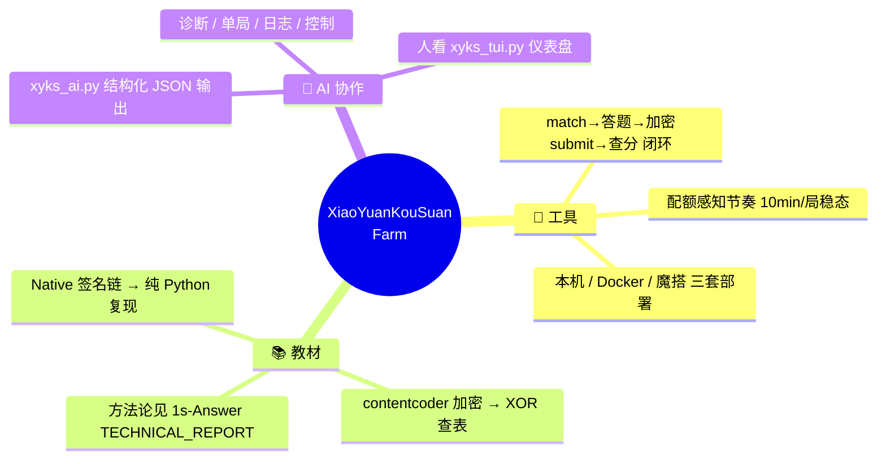
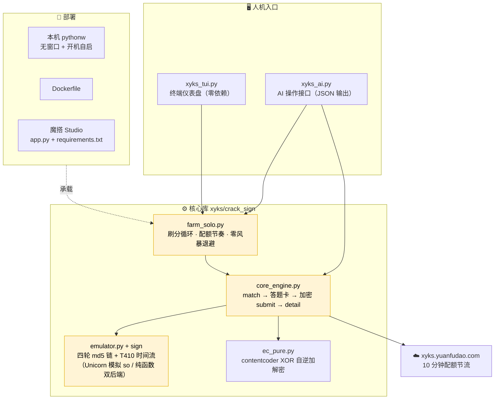
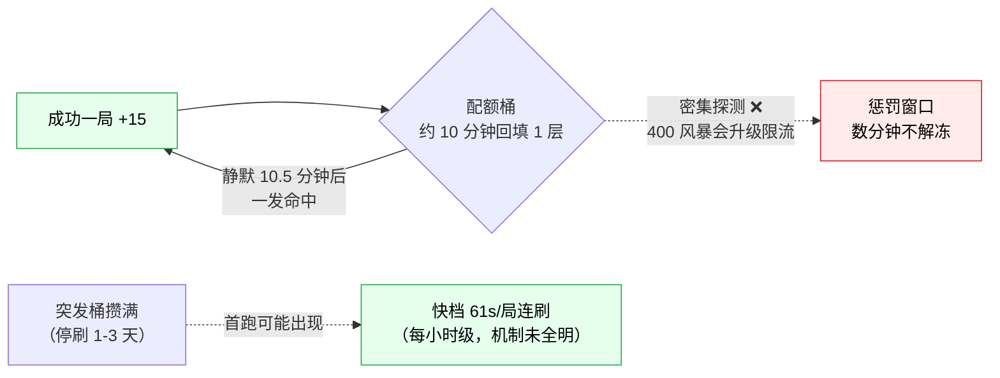

# XiaoYuanKouSuan-Farm

> 小猿口算 PK 荣誉分自动刷分工具：请求签名 / 内容加密的纯 Python 还原 + 配额感知的刷分循环 + 人（TUI）/ AI（JSON CLI）双驱动接口。
>
> 🔐 逆向原理与改包 APK 见姊妹仓库 **[XiaoYuanKouSuan-1s-Answer](https://github.com/GaoYangHeng/XiaoYuanKouSuan-1s-Answer)**（技术报告、so patch、smali 工程都在那边，本仓库不重复收录，只引用）。

## 项目定位



## 总体架构



## 配额模型（实测结论）



> 详见 [docs/QUOTA.md](docs/QUOTA.md)：两层锁、solo/multi 共享配额、失败请求降权证伪等 6 条实测定论。

## AI 操作接口

```mermaid
flowchart LR
    AGENT["AI Agent"] -->|"xyks_ai.py status"| J1["{\"score\":3245,<br/>\"pace\":\"10.5min\",<br/>\"health\":\"ok\"}"]
    AGENT -->|"diagnose"| J2["{\"issues\":[],<br/>\"advice\":\"...\"}"]
    AGENT -->|"round --once"| J3["单局执行结果"]
    AGENT -->|"logs --tail 50"| J4["最近日志数组"]
    J1 & J2 & J3 & J4 --> AGENT
    AGENT -.->|"决策后写回"| CTRL["start / stop / 调参"]
```

| 命令 | 作用 | 退出码 |
|---|---|---|
| `xyks_ai.py status` | 分数/节奏/进程健康（JSON） | 0（advice 字段提示异常） |
| `xyks_ai.py score` | 仅查周荣誉分 | 0 成功 / 1 失败 |
| `xyks_ai.py round --once` | 手动跑一局（含逐步耗时） | 0 胜 / 1 失败 |
| `xyks_ai.py logs --tail N` | 最近日志（JSON 数组） | 0 |
| `xyks_ai.py diagnose` | 自动诊断 + 处理建议 | 0 无需处理 / 2 需人工 |
| `xyks_ai.py start / stop` | 本机常驻 farm 控制 | 0 |

## 快速开始

```bash
# 1) 依赖（Python ≥ 3.10）
pip install -r requirements.txt

# 2) 自备签名 so（版权原因不随仓库分发）
#    从官方 APK 提取：
unzip -j <小猿口算.apk> "lib/armeabi-v7a/libRequestEncoder.so" -d xyks/so/
#    签名校验 patch 脚本：见 1s-Answer 仓库 opensource/snippets/sign/

# 3) 登录拿 cookie（短信验证码）
XYKS_PHONE=138xxxx  XYKS_SMS_CODE=xxxxxx python xyks/crack_sign/login136.py
#    已有 cookie？直接 cp xyks/crack_sign/login136.example.json xyks/crack_sign/login136.json 填入

# 4) 跑一局验证
python xyks_ai.py round --once

# 5) 常开刷分
python xyks_tui.py        # 人：仪表盘
# 或
python xyks_ai.py start   # AI/后台
```

部署矩阵（本机 / Docker / 魔搭）见 [docs/DEPLOY.md](docs/DEPLOY.md)，架构细节见 [docs/ARCHITECTURE.md](docs/ARCHITECTURE.md)。

## 声明

本项目为安全研究与教育用途的逆向工程与自动化笔记，详见 [DISCLAIMER.md](DISCLAIMER.md)（完整声明引用自 [1s-Answer](https://github.com/GaoYangHeng/XiaoYuanKouSuan-1s-Answer/blob/main/opensource/DISCLAIMER.md)）。PK 对局中有真人玩家，自动化会直接影响他人体验，请自行评估使用场景。
