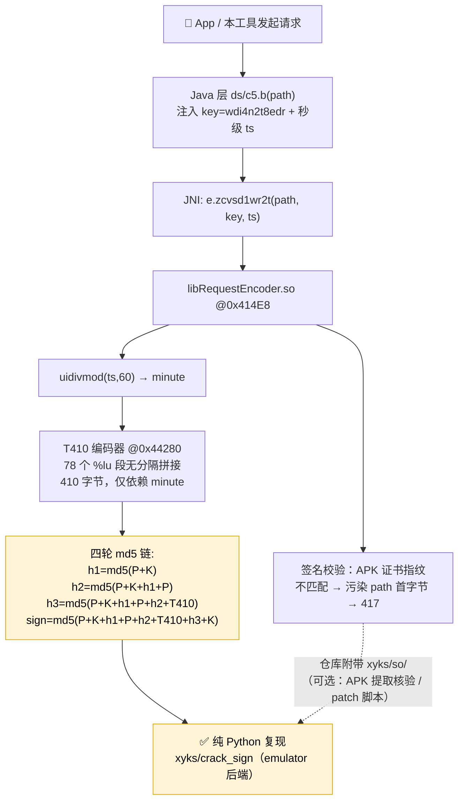
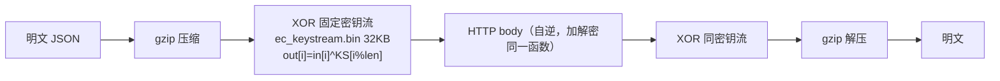
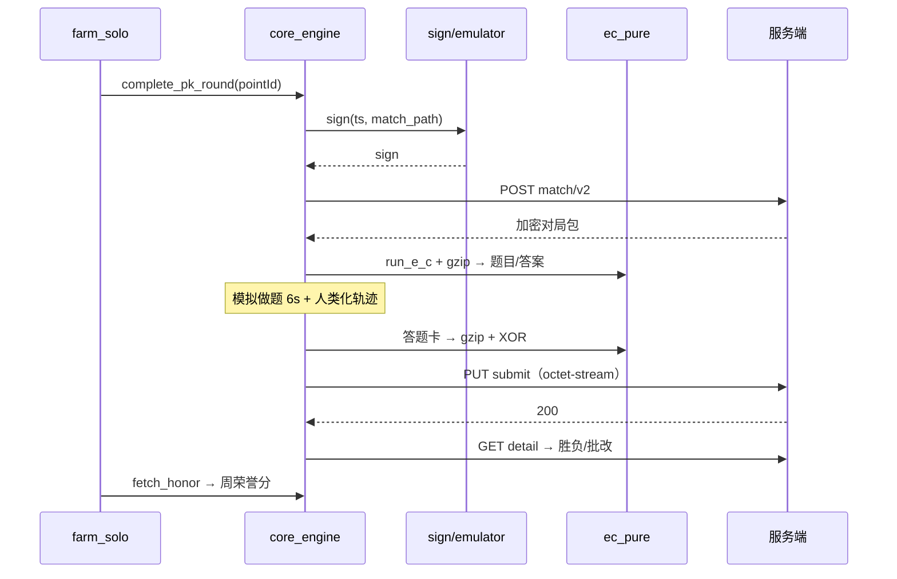

# 架构与逆向链

## 一、请求签名链（从抓包到纯 Python）



> T410 与 path/设备无关（实验验证），因此**同一分钟内所有接口共享同一份 T410**，签名计算可按分钟缓存。

## 二、内容加密链（contentcoder）



纯 Python 实现见 `xyks/crack_sign/ec_pure.py`（CPython / MicroPython 双端可跑）。

## 三、一局的完整数据流



## 四、模块地图

```mermaid
mindmap
  root((xyks/))
    crack_sign/
      core_engine.py 引擎
      farm_solo.py 刷分循环
      emulator.py 签名模拟 Unicorn
      ec_pure.py 加解密
      login136.py 登录入口
      pc_pk_round.py HTTP 基础
    mod_apk/work/
      login_sms.py 短信登录协议
    so/ 用户自放签名 so
    apply_server.py Linux 路径适配
    web_status.py 状态页
  入口层
    xyks_ai.py AI JSON CLI
    xyks_tui.py 仪表盘
    app.py 魔搭入口
```
