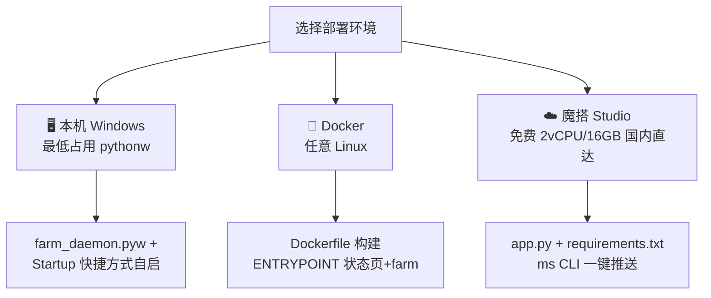
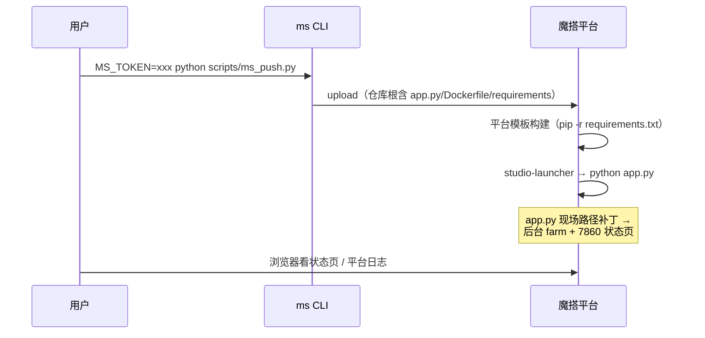

# 部署指南（三套方案）



## 一、本机 Windows（零占用常驻）

```powershell
# 依赖
pip install unicorn pyelftools
# 签名 so 已随仓库附带（xyks/so/）：
python xyks_ai.py start     # 无窗口后台
python xyks_tui.py          # 看仪表盘
python xyks_ai.py stop      # 停止
```

- 入口：`deploy/windows/farm_daemon.pyw`（pythonw 运行，日志 → `farm_daemon.log`）
- 开机自启：`python deploy/windows/install_autostart.py`（写入启动文件夹 .lnk，无需管理员）
- 资源：CPU 平均 <1%（每局 4-5 次签名 ×0.18s），内存 ~60MB

## 二、Docker

```bash
docker build -t xyks-farm .
# cookie/so 需在构建前放入 xyks/（见 Dockerfile 注释）
docker run -d --name xyks-farm -p 8080:8080 xyks-farm
docker logs -f xyks-farm     # farm 日志
# 状态页: http://localhost:8080
```

## 三、魔搭 Studio（推荐 · 免费 · 国内直连）



1. 注册 [modelscope.cn](https://modelscope.cn) → 个人设置创建 Access Token
2. `pip install modelscope-hub`
3. `MS_TOKEN=ms-xxx XYKS_REPO=你的用户名/xyks-farm python scripts/ms_push.py`
4. 平台约定要点（踩坑总结）：
   - **忽略自定义 Dockerfile**，只认仓库根 `requirements.txt`
   - 启动命令固定 `python app.py`，工作目录 = 仓库挂载点
   - 健康检查打 **7860** 端口，状态页必须在此端口应答
   - 空闲会休眠，「访问即唤醒」——可用状态页保活

## 登录与凭证

```bash
# 短信验证码登录（凭证仅存本地 login136.json，已 gitignore）
pip install -r requirements.txt   # 含 pycryptodome（短信登录的 RSA 加密需要）
XYKS_PHONE=138xxxx XYKS_SMS_CODE=xxxxxx python xyks/crack_sign/login136.py
```

> 容器/魔搭部署的凭证注入：`login136.json` 不入库，构建前手动放入 `xyks/crack_sign/` 随 COPY 进镜像（魔搭则随仓库文件上传——**注意此时它存在于你的私有仓库中，勿把仓库转公开**）。

> 约束提醒：服务端配额约 10 分钟/局（见 [QUOTA.md](QUOTA.md)），部署位置不改变速率。
