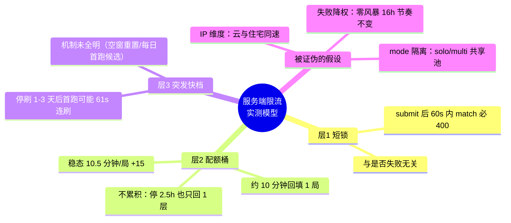
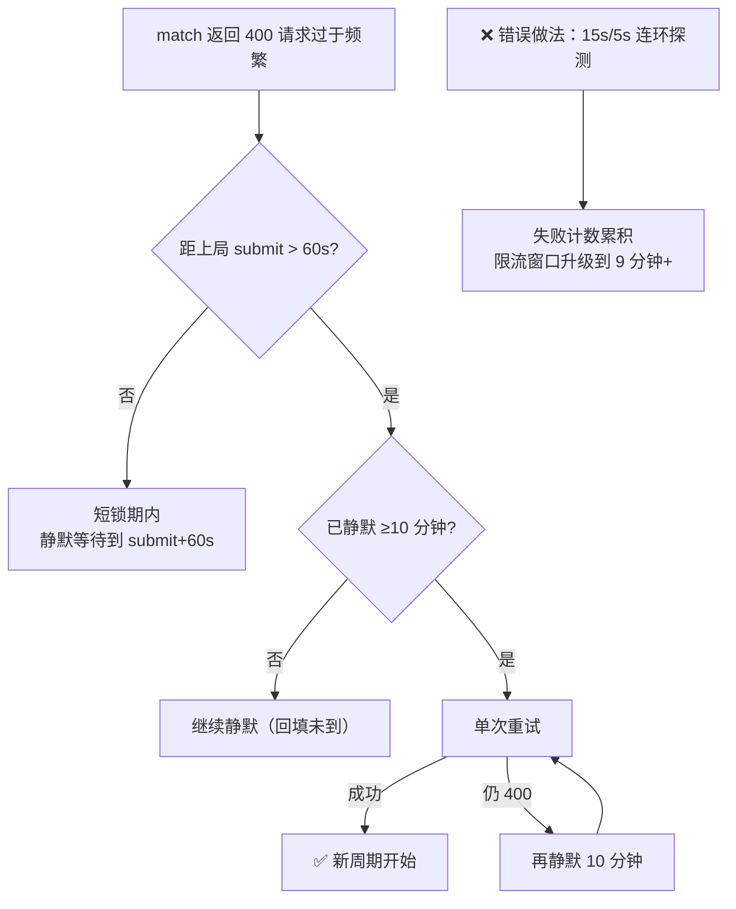
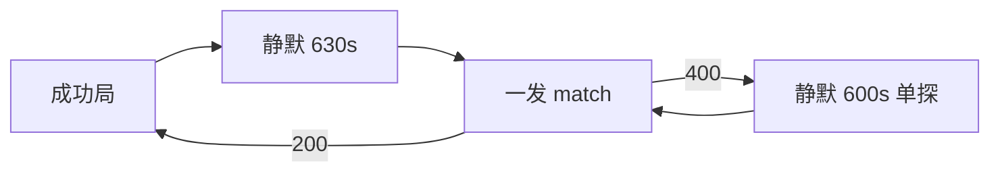

# 配额与限流实测研究

> 以下 6 条结论全部来自真实抓包与长时间对照实验（累计 70+ 局、跨本机/云服务器双环境）。

## 配额模型（思维导图）

## 决策流程：撞到 400 怎么办

## 实验结论速查

| # | 假设 | 结论 | 证据 |
|---|---|---|---|
| 1 | 417 = IP 拦截 | ❌ | 云/住宅同速，417 实为 sign 算法错误 |
| 2 | 417 = 账号风控 | ❌ | 同账号手机端始终正常 |
| 3 | 配额按 mode 隔离 | ❌ | solo 配额空窗期打 multi 同样 400 |
| 4 | 失败请求会降权 | ❌ | 零风暴策略 16 小时节奏不变 |
| 5 | 停机攒层数 | ❌ | 停 2.5 小时仅回填 1 层 |
| 6 | 稳态速率 | ✅ 10.5 分钟/局 | 70+ 局规整间隔，≈ +87 分/小时 |

## 已验证的最优策略（零风暴）

- 每局失败请求 ≤ 1 次（旧密集策略为 4-8 次）
- 节奏与密集探测持平（10.5min），但账号状态干净、零风暴记录
